# TOPKHALIJ 公会 1.3 增量需求文档

> 文档版本：1.3  
> 文档类型：相对公会 1.0 / 1.1 / 1.2 的增量需求  
> 核心目标：新增第三种政策“自由政策（周结）”，并完成客户端、后台、结算与提现链路的对应调整  
> 规则来源：`TOPKHALIJ公会1.3.xmind`、1.3 原型图，以及用户前面提供的 3 份历史文档（公会 1.0、公会 1.1、公会 1.2）  
> 本文只描述 1.3 新增或调整内容；未明确变化的旧功能继续沿用既有版本

---

## 一、文档边界与事实源

### 1.1 事实源使用规则

| 优先级 | 事实源 | 使用方式 |
|---:|---|---|
| 1 | 用户当前明确确认 | 作为最高规则；用户已确认新政策与原政策并存，并要求“原型有、脑图没有内容的字段和逻辑不要硬补” |
| 2 | `TOPKHALIJ公会1.3.xmind` | 确定 1.3 的正式功能范围、业务规则、配置值和计算口径 |
| 3 | 1.3 原型图 | 只补充脑图已覆盖模块的页面位置、字段命名、按钮文案和静态展示结构 |
| 4 | 用户前面提供的 3 份历史文档：公会 1.0、公会 1.1、公会 1.2 | 三份必须一并对照：1.0 提供完整业务基线；1.1、1.2 提供后续增量、保留项及权限边界 |

**三份历史文档的继承关系：**

- **公会 1.0**：完整定义自由政策工资计算、工资项拆分、余额池、提现、失败回滚、历史结算和快照审计。
- **公会 1.1**：明确薪资、结算、提现、资产及后台审核规则不变；新增管理员角色、页面和“管理员只能移除主播，不能移除公会长或其他管理员”等权限边界。
- **公会 1.2**：同样未调整薪资和资金链；其管理员相关内容作为后续增量材料核对，但未明确覆盖 1.1 的权限边界时，不得据此扩大管理员权限。
- 因此，后文写“沿用 1.0 公式/资金链”，表示已对照三份历史文档后确认 1.1、1.2 未修改该项；并不表示本需求只参考了 1.0。

### 1.2 原型使用边界

1. 原型图不是独立业务需求来源；原型有而脑图无的字段、功能、公式、状态或流程，不写成 1.3 正式需求。
2. 此类内容只标注为“原型可见但不纳入正式需求”，一律不据此新增字段和交互，仅用于原型差异定位或登记待确认。
3. 原型示例金额、比例、日期不作为正式业务参数；正式参数以脑图为准。
4. 原型与脑图冲突时，正文采用脑图规则，并将原型问题列入待修正清单。
5. 原型中未被脑图覆盖的旧页面结构继续沿用现有版本，不因本次原型截图而重做。

### 1.3 版本范围

| 端/业务域 | 1.3 正式改动 |
|---|---|
| 客户端—加入公会 | 原两种政策名称增加周期标识，并新增“自由政策（周结）” |
| 客户端—公会长薪资 | 展示公会长当前薪资政策类型 |
| 客户端—公会薪资 | 增加月数据/周数据 Tab；增加周数据看板及周历史明细 |
| 后台—主播列表 | 新增成员、政策筛选、结算政策列支持“自由政策（周结）” |
| 后台—主播薪资 | 增加周结筛选、月/周日期联动、周数据统计及导出 |
| 后台—公会薪资 | 增加周结筛选、月/周日期联动、周数据统计及导出 |
| 结算 | 增加自然周结算；UTC+3 每周一 00:00 结算上一自然周；公式沿用自由政策 |
| 提现 | 增加金币工资“全部提现”；普通工资提现金币排除金币工资；两类工资采用不同换算比例 |
| 明细/记录 | 金币工资明细隐藏两个扣减字段；提现记录中的同名字段处理动作待确认 |

### 1.4 非本次新增范围

以下内容未在 1.3 脑图中定义，本次不新增、不重设：

- 入会冷却期、入会申请状态机、自动拒绝倒计时；
- 公会长在主播管理页调整政策的新增权限、次数和入口；政策切换日期按 3.5 执行；
- 主播本人薪资页新增字段或新交互；
- 提现成功弹窗；
- 金币工资收入记录的字段结构；
- 提现记录的完整状态、字段和操作；
- 后台政策筛选冲突时采用禁用、自动清空还是提示拦截的具体表现；
- 任何脑图未定义的新增接口、技术字段、数据库结构和任务实现方式。

---

## 二、开发速读版

### 2.1 一句话业务变化

公会政策由两种扩展为三种，在保留原两种月结政策的基础上新增“自由政策（周结）”；周结只改变结算周期和统计时间维度，工资计算仍沿用自由政策，结算结果继续进入现有工资拆分、余额池、提现和历史快照链路。

### 2.2 三种政策并存关系

| 正式展示名称 | 结算周期 | 计算模型 | 1.3 处理 |
|---|---|---|---|
| TG政策（月结） | 自然月 | 沿用现有 TG/普通政策 | 原“普通政策”展示名调整；计算和统计不变 |
| 自由政策（月结） | 自然月 | 沿用现有自由政策 | 原“自由政策”展示名调整；计算和统计不变 |
| 自由政策（周结） | 自然周 | 沿用现有自由政策 | 1.3 新增第三种政策 |

### 2.3 核心时间和筛选规则

- 周结周期为自然周。
- 按 UTC+3，每周一 00:00 结算上一自然周的薪资数据；周区间左闭右开。
- 主播更改政策按当前政策限制：自由政策（周结）仅每周一，TG政策（月结）和自由政策（月结）仅每月1号；更改成功后，当天更改前的流水和余额也计入新政策，见 3.5。
- 两种月结政策可以同时筛选。
- 任一月结政策不能与“自由政策（周结）”同时筛选。
- 月结政策联动月选择器；周结政策联动周选择器。
- 周数据不能混入两种月结政策的数据。
- 历史周数据读取已结算周快照，不按当前政策重新计算。

### 2.4 资金链沿用关系

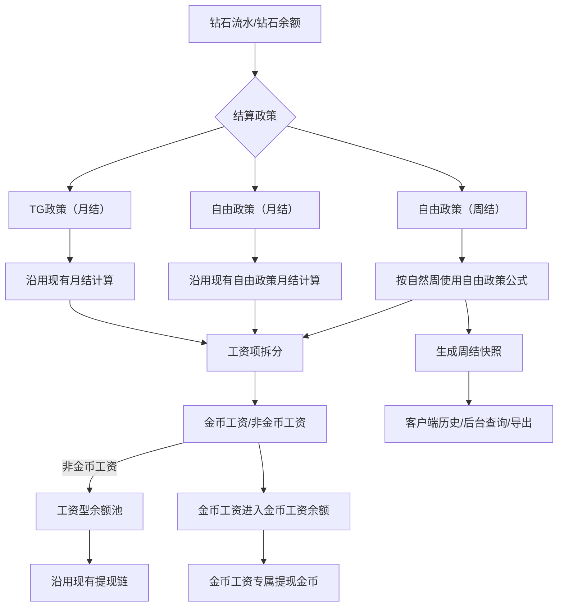
```mermaid
flowchart TD
    A[钻石流水/钻石余额] --> B{结算政策}
    B --> C[TG政策（月结）]
    B --> D[自由政策（月结）]
    B --> E[自由政策（周结）]
    C --> F[沿用现有月结计算]
    D --> G[沿用现有自由政策月结计算]
    E --> H[按自然周使用自由政策公式]
    F --> I[工资项拆分]
    G --> I
    H --> I
    I --> J[金币工资/非金币工资]
    J -->|非金币工资| M[工资型余额池]
    J --> L[金币工资进入金币工资余额]
    L --> N[金币工资专属提现金币]
    M --> O[沿用现有提现链]
    H --> P[生成周结快照]
    P --> Q[客户端历史/后台查询/导出]
```

> 1.3 没有重定义工资拆分、余额池和已结算历史的基础规则；除本文明确修改的金币提现口径外，其余继续沿用现有版本。

### 2.5 模块阅读索引

| 研发/设计任务 | 重点章节 |
|---|---|
| 政策枚举与周结计算 | 三、四 |
| 主播加入公会政策选择 | 五、5.1 |
| 公会长薪资与周数据 | 五、5.2～5.4 |
| 后台主播列表 | 六、6.1 |
| 后台主播薪资 | 六、6.2 |
| 后台公会薪资 | 六、6.3 |
| 金币工资全部提现 | 七、7.1～7.2 |
| 普通工资提现金币调整 | 七、7.3 |
| 快照、历史与多公会归属 | 八 |
| 原型冲突和业务缺口 | 九、十 |

---

## 三、1.3 业务模型

### 3.1 核心业务对象

| 对象 | 1.3 业务定义 | 变化类型 |
|---|---|---|
| 结算政策 | 主播及公会长薪资结算所使用的政策；1.3 扩展为三种政策枚举 | 调整 |
| 自由政策（周结） | 以自然周为结算周期、按自由政策公式计算的第三种政策 | 新增 |
| 自然周结算周期 | 上一自然周薪资的统计、结算和历史归属单位 | 新增 |
| 周结快照 | 周结完成时冻结的政策、关系和薪资结果；用于历史展示、后台查询与导出 | 新增周期维度，快照机制沿用 |
| 金币工资 | 只能按金币工资专属口径提现为金币的工资余额 | 提现方式调整 |
| 非金币工资 | 沿用现有工资型余额规则，可走现有提现链；提现为金币时使用新的非金币工资比例 | 比例调整 |

### 3.2 角色与数据归属

| 角色 | 周结中的身份 | 数据归属 |
|---|---|---|
| 主播 | 使用“自由政策（周结）”时生成主播周薪 | 按主播、自然周和所属公会形成结算结果 |
| 公会长 | 公会长本人政策为周结时，其作为主播的数据需要计入周数据 | 按公会长本人主播身份计入对应公会周数据 |
| 公会长 | 查看公会薪资周数据及周历史明细 | 仅查看本公会周结政策范围内的数据和历史快照 |
| 后台人员 | 查询主播薪资、公会薪资并导出 | 按政策类型、周期和公会维度查询 |

### 3.3 周结主链

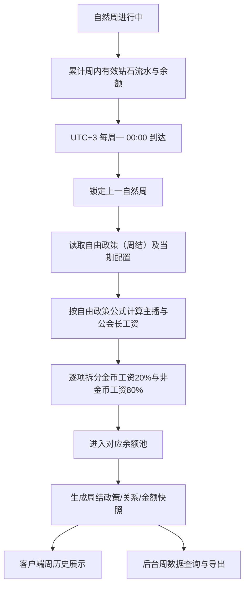
```mermaid
flowchart TD
    A[自然周进行中] --> B[累计周内有效钻石流水与余额]
    B --> C[UTC+3 每周一 00:00 到达]
    C --> D[锁定上一自然周]
    D --> E[读取自由政策（周结）及当期配置]
    E --> F[按自由政策公式计算主播与公会长工资]
    F --> G[逐项拆分金币工资20%与非金币工资80%]
    G --> I[进入对应余额池]
    I --> J[生成周结政策/关系/金额快照]
    J --> K[客户端周历史展示]
    J --> L[后台周数据查询与导出]
```

### 3.4 周期边界

| 规则项 | 规则 |
|---|---|
| 周期类型 | 自然周，不是滚动 7 天 |
| 结算时点 | UTC+3 每周一 00:00 |
| 结算对象 | 结算时点之前刚结束的上一自然周 |
| 区间表达 | 周一 00:00（含）至下周一 00:00（不含）；沿用历史周期左闭右开口径，边界时刻新产生的数据归新周 |
| 时区 | UTC+3；周统计、结算、客户端周历史、后台周查询和导出使用同一业务时区 |
| 月结政策 | 原统计方式、计算方式和时间维度不变 |

### 3.5 主播更改政策：开放日期与当天数据归属

#### 开放日期与限制提示

按用户更改前的当前政策判断是否允许更改，不按目标政策判断。以下规则替代原“所有政策仅每月 1 号可更改”的统一日期限制；不据此新增操作角色权限、入口或修改次数规则。

| 用户当前政策 | 允许更改日期 | 非开放日期处理 | Toast文案 |
|---|---|---|---|
| 自由政策（周结） | 仅每周一 | 不允许提交政策更改，原政策及数据归属保持不变 | 用户当前为周结政策，仅支持在每周一更改政策 |
| TG政策（月结） | 仅每月1号 | 不允许提交政策更改，原政策及数据归属保持不变 | 用户当前为月结政策，仅支持在每月1号更改政策 |
| 自由政策（月结） | 仅每月1号 | 不允许提交政策更改，原政策及数据归属保持不变 | 用户当前为月结政策，仅支持在每月1号更改政策 |

#### 更改当天的流水与余额

- 更改成功后，当天更改政策前的流水和余额也计入新政策；不能仅从点击更改成功的时刻开始按新政策统计。
- 当天更改前和更改后的数据按新政策归属，进入新政策对应的月结或周结统计与计算；同一笔数据不能在旧政策与新政策中重复累计。
- 更改当天流水、余额的政策归属发生调整，但不把流水和余额合并成同一计算基数，也不将账户存量余额当作一笔新增流水或新增余额入账。有效流水与有效余额仍按各自既有口径参与工资计算，不新增余额加减公式。
- 客户端相关实时薪资、后台主播薪资、公会薪资及导出均按上述新归属读取；不改变各页面已确认的筛选控件、日期选择器和默认值。
- 保留更改前后政策、操作人、操作对象、操作时间、归属日期、对应结算周期及当天数据转归结果，使后续工资计算和快照能够解释更改前的当天数据为何采用新政策。
- 既有已结算历史不因当前政策更改而自动重算。若当天数据已因离会等操作完成结算，再发生政策更改，与“当天更改前数据计入新政策”的冲突如何处理，仍需确认，不能静默重算或重复入账。

日期判断时区及当天已结算数据的处理边界见 P0-04；原月结历史规则不能覆盖本次已确认的周一开放规则和当天归属规则。

---

## 四、新增政策：自由政策（周结）

### 4.1 政策定位

“自由政策（周结）”是与“自由政策（月结）”“TG政策（月结）”并存的第三种政策，不替换任何现有政策。

周结与自由月结的关系：

- 计算模型相同；
- 统计和结算周期不同；
- 快照周期标识不同；
- 客户端周数据、后台周查询和周导出均只读取周结数据；
- 已结算历史不因当前政策变化而改算。

### 4.2 政策配置

| 配置项 | 1.3 值 | 用途 |
|---|---:|---|
| 分成比 | 0.8 | 代入自由政策工资计算 |
| 钻石换算美元比例 | 130000 | 每 1 USD 对应的钻石数量 |
| 强制充值工资比例 | 0.2 | 即金币工资奖励比例；每个工资项的 20% 为金币工资，剩余 80% 为非金币工资 |
| 主播分成比例 | 0.73 | 代入主播工资计算 |
| 公会长分成比例 | 0.27 | 代入公会长工资计算 |

### 4.3 工资计算

经三份历史文档对照，公会 1.1、1.2 均未修改薪资与资金链，因此周结政策沿用公会 1.0 已确认的自由政策计算模型，只把计算、结算和快照周期从自然月切换为自然周。开发不得另建一套“周结专用工资公式”，也不得把自由政策的主播侧计算基数和公会长侧计算基数混为同一个字段。

#### 4.3.1 周期、对象与变量

以下公式均针对一个待结算自然周、一个公会归属和一个“自由政策（周结）”政策快照执行：

| 变量 | 业务含义 | 取值要求 |
|---|---|---|
| `W` | 当前计算对应的自然周 | UTC+3 每周一 0 点结算上一自然周，区间左闭右开 |
| `G` | 数据归属公会 | 按主播、自然周、公会及归属时间段/快照分别成单；离会前结算原公会数据，见 8.3 |
| `D_flow` | 本周有效钻石流水 | 仅汇总 `W + G + 自由政策（周结）` 范围内的有效流水；旧版规则中，非幸运礼物按 `1 金币 = 2 钻石`、幸运礼物按 `10 金币 = 2 钻石`换算，再排除冻结、拒付及无效流水 |
| `D_balance` | 本周有效钻石余额 | 读取既有自由政策在该自然周形成的有效钻石余额结算结果；它是主播工资基数，不等于本周有效钻石流水，也不使用公会长侧流水公式反推 |
| `R_total` | 分成比 | 1.3 配置为 `0.8` |
| `R_anchor` | 主播分成比例 | 1.3 配置为 `0.73` |
| `R_leader` | 公会长分成比例 | 1.3 配置为 `0.27` |
| `D_per_USD` | 钻石换算美元比例 | 1.3 配置为 `130000`，含义为 `1 USD` 对应的钻石数量 |
| `R_coin` | 金币工资奖励比例 | 即强制充值工资比例，周结取 `0.2`；仅用于工资项拆分，不替代总工资计算的分成比 |

> 旧版材料没有给出可独立重建 `D_balance` 的完整加减公式。因此本文保留它作为既有结算结果字段，不用“起始余额 + 流水 - 兑钻”等对账字段拼出一套未经确认的新算法。

#### 4.3.2 角色工资公式

| 工资项 | 计算公式 | 计算基数与归属 |
|---|---|---|
| 单个主播周总薪资 `S_anchor` | `D_balance × R_total ÷ D_per_USD × R_anchor` | 使用该主播在 `W + G` 下的本周有效钻石余额；包含后续待拆分的金币工资和非金币工资 |
| 单个主播贡献的公会长周薪资 `S_leader_contrib` | `D_flow × R_total ÷ D_per_USD × R_leader` | 使用该主播在 `W + G` 下的本周有效钻石流水；归属对应公会长管理收益 |
| 公会主播周总薪资 | `Σ S_anchor` | 汇总该公会本周纳入周结的主播侧工资项；公会长本人作为主播且符合周结范围时，其主播侧工资按同一公式独立计算并计入 |
| 公会长管理周薪资 | `Σ S_leader_contrib` | 汇总该公会本周所有有效周结主播贡献的公会长侧工资项 |
| 公会周总薪资 | `公会主播周总薪资 + 公会长管理周薪资` | 两侧均使用同一自然周、同一公会归属和同一结算快照版本 |

代入 1.3 配置后：

- 单个主播周总薪资 = 本周有效钻石余额 × `0.8` ÷ `130000` × `0.73`。
- 单个主播贡献的公会长周薪资 = 本周有效钻石流水 × `0.8` ÷ `130000` × `0.27`。

公会长本人兼主播时，必须先生成“本人主播工资项”和“公会长管理收益项”，再分别完成金币/非金币拆分和角色汇总，不能把两类工资先合成一个金额后倒拆。公会长总薪资只包含管理收益，不包含本人主播薪资。本人主播薪资计入主播总薪资，在公会总薪资中只累计一次。

#### 4.3.3 金币工资拆分与余额池

按三份历史文档中仍适用的工资拆分规则及本次业务确认，周结处理顺序为：`逐工资项计算 → 每项拆分金币/非金币工资 → 按角色汇总 → 写入余额池 → 生成周结快照`。

对每个主播工资项和公会长工资项分别执行：

| 结果项 | 计算/处理口径 |
|---|---|
| 金币工资 | `工资项 × R_coin = 工资项 × 0.2`；进入金币工资奖励余额，只能走金币工资对应的金币提现出口 |
| 非金币工资 | `工资项 × (1 - R_coin) = 工资项 × 0.8`；进入工资型余额处理 |
| 工资型余额池入账 | 本期非金币工资，按主播/公会长角色进入对应个人薪资余额 |
| 金币工资余额池入账 | 当前工资项拆出的金币工资；不进入现金提现、提现给公会长 |
| 主播转入薪资余额 | 仅承接既有“提现给公会长”审核通过后的转入金额，与周结原始工资项分开记录，不计入本周工资重算 |

> 强制充值工资比例即 `R_coin = 0.2`，在角色工资项算出后拆分；总工资公式的分成比仍为 `R_total = 0.8`。两者作用步骤不同，不得混用。

#### 4.3.4 计算时点与结果性质

| 场景 | 计算与读取规则 |
|---|---|
| 自然周进行中 | 如页面展示进行中数据，只能作为未结算结果；默认展示当前周还是最近已结算周见 P1-07 |
| 周一 0 点触发结算 | 以 UTC+3 关闭上一自然周，锁定该周政策、成员关系、有效流水、有效余额、工资拆分和余额池结果 |
| 结算成功后 | 形成正式周结快照；客户端历史、后台查询、导出均读取该快照 |
| 结算失败/重试 | 不得重复生成工资或重复写入余额池；恢复处理须关联原结算记录、归属快照和已入账结果，不得将已结算的离会记录再次入账 |
| 政策或公会关系后续变化 | 政策更改按当前政策判断开放日期；更改成功后，当天更改前的流水和余额也计入新政策且不重复统计，见 3.5。已结算历史不自动重算；跨公会归属继续按 8.3 处理，当天已结算数据与政策更改冲突见 P0-04 |

### 4.4 结算后处理

周结工资形成后，继续沿用现有自由政策资金链：

1. 按现有规则拆分金币工资和非金币工资；
2. 非金币工资进入现有工资型余额池；
3. 金币工资进入金币工资余额；
4. 生成周结政策、关系、统计结果和金额快照；
5. 客户端历史、后台查询和导出读取同一周期快照。

第 1 步按金币工资 20%、非金币工资 80% 拆分。结算完成并生成快照、余额池结果后，按历史规则清空该次已结算的主播钻石余额，避免在后续周期重复计薪。

### 4.5 结算结果状态

1.3 脑图只定义结算时点和结算成功后的数据用途，没有新增结算状态枚举。结算中、结算失败、重试和人工补算状态继续沿用现有版本；若现有版本无法覆盖周结，需要另行确认，不在本文擅自增加状态。

---

## 五、客户端增量需求

### 5.1 主播加入公会—选择政策

#### 页面定位

主播申请加入公会时，在政策选择环节展示三种政策。

#### 对应原型

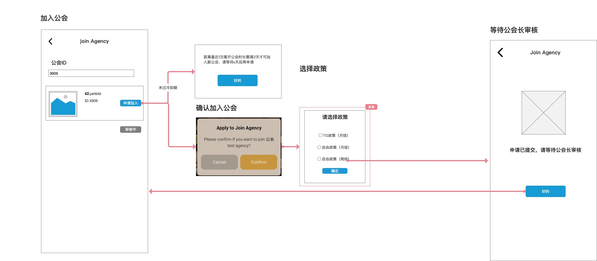

#### 1.3 改动

| 改动位置 | 原内容 | 1.3 内容 | 变更类型 |
|---|---|---|---|
| 政策选项 | 普通政策 | TG政策（月结） | 名称调整 |
| 政策选项 | 自由政策 | 自由政策（月结） | 名称调整 |
| 政策选项 | 无 | 自由政策（周结） | 新增 |

#### 页面规则

- 三种政策作为并列政策选项展示。
- “自由政策（周结）”是独立政策，不是“自由政策（月结）”下的周期开关。
- 原型采用单选列表和“确定”按钮，可作为页面布局依据。
- 默认选中项、是否必选、未选择时的提示未被脑图定义，本次不新增规则。
- 冷却期、申请提交、审核和成功提示沿用现有版本，不作为 1.3 改动。

---

### 5.2 公会长薪资数据—展示当前政策类型

#### 页面定位

在公会长薪资数据看板中展示公会长当前的薪资政策类型。

#### 对应原型

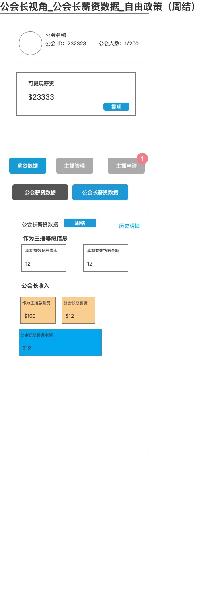

#### 1.3 新增字段

| 字段 | 展示内容 |
|---|---|
| 当前薪资政策类型 | TG政策（月结）/自由政策（月结）/自由政策（周结） |

#### 展示规则

- 使用完整政策名称，必须同时能区分政策模型和结算周期。
- 原型中的“周结”“周结政策”“自由政策”等简称不作为最终展示枚举。
- 看板其他金额字段和历史入口沿用现有页面，不在本次扩写。

#### 组合原型参考

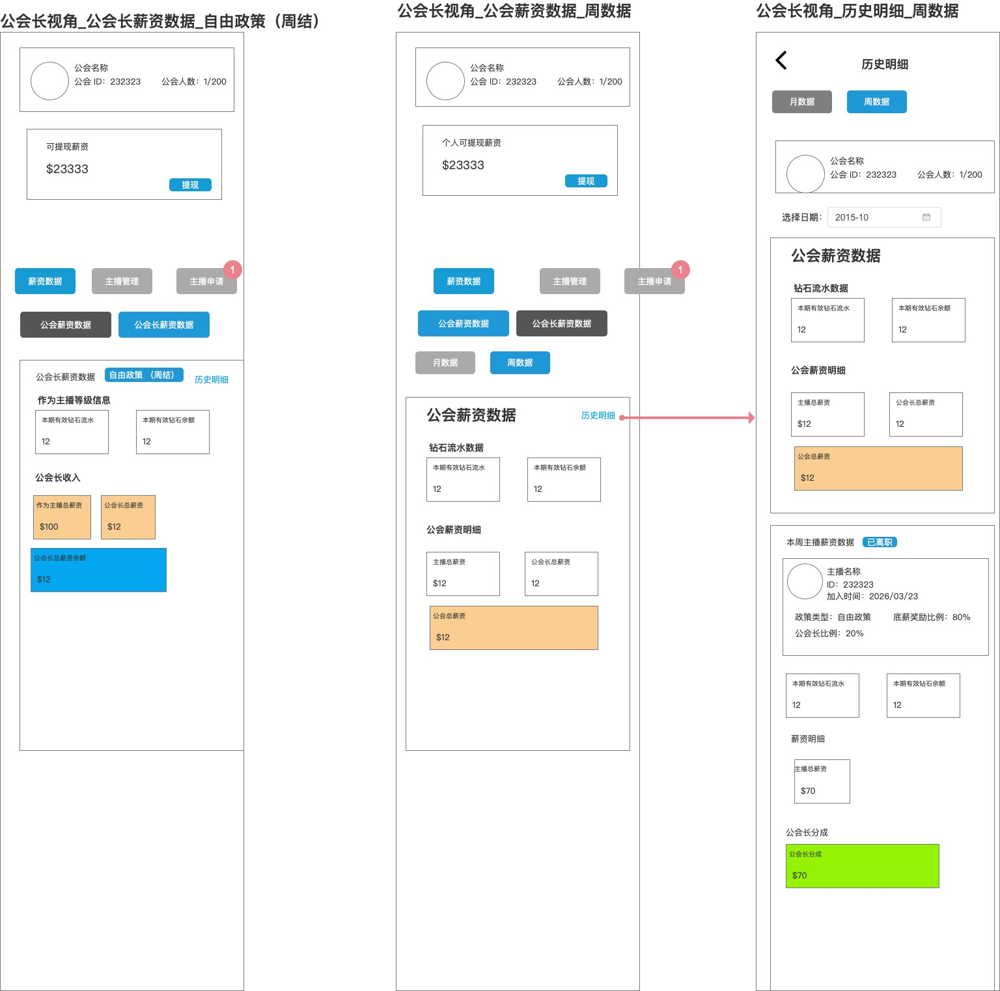

该图用于确认周结标签与公会薪资周数据的页面位置。图中未被脑图定义的旧字段、金额和比例不作为新增需求。

---

### 5.3 公会薪资数据—月数据/周数据

#### 页面定位

公会长查看公会薪资数据时，增加结算周期维度切换。

#### 对应原型

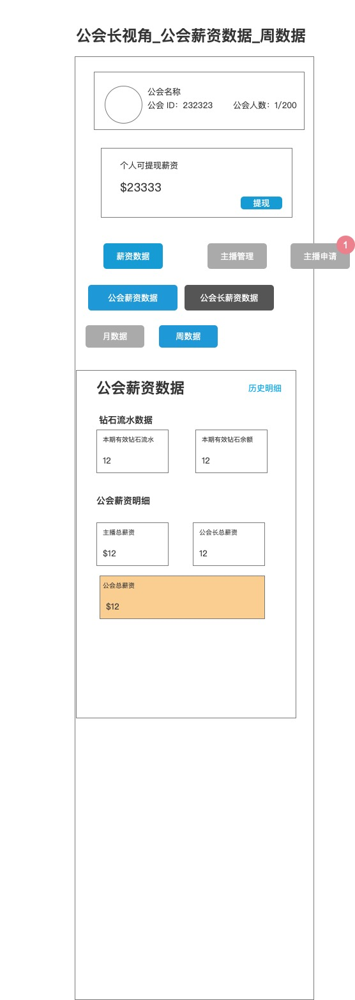

#### 页面结构调整

| 区域 | 1.3 规则 |
|---|---|
| 周期 Tab | 增加“月数据”“周数据”两个 Tab |
| 月数据 | 现有功能，不调整统计方式、计算方式和页面结构 |
| 周数据 | 新增周数据看板 |
| 历史入口 | 周数据中的“历史明细”跳转至历史明细—周数据 |

#### 周数据报表范围

- 报表字段结构复用现有公会薪资数据，但计算周期替换为所选自然周。
- 数据范围仅包括归属于当前公会且结算政策为“自由政策（周结）”的主播工资与公会长管理收益。
- 公会长本人同时作为主播且本人主播政策为“自由政策（周结）”时，其主播侧工资按周结主播规则独立计算并计入主播汇总。
- “自由政策（月结）”和“TG政策（月结）”不得计入周数据，也不得与周数据合并成一个总额。
- 同一自然周跨多个公会的记录必须先按公会归属拆分，再进入各公会周报；同一事件不得在两个公会重复统计。按加入/离开归属时间段和对应快照切割，见 8.3。

#### 周数据字段与计算口径

| 字段 | 周数据业务定义 | 计算方式 / 取值规则 | 数据来源 |
|---|---|---|---|
| 公会名称 / 公会ID | 当前周数据所属公会 | 读取所选自然周对应的公会归属；已结算数据读取关系快照 | 公会资料 / 公会关系快照 |
| 公会人数 | 页面现有的公会人数摘要 | 进行中页面读取当前成员结果；历史周不得用当前人数覆盖历史快照 | 公会成员关系 / 历史快照 |
| 本期有效钻石流水 | 当前公会周结范围内的有效钻石流水合计 | `Σ 各周结主播 D_flow`；非幸运礼物按 `1金币=2钻石`、幸运礼物按 `10金币=2钻石`换算，再排除冻结、拒付及无效流水 | 钻石流水结果 / 周结快照 |
| 本期有效钻石余额 | 当前公会周结范围内用于主播工资换算的有效钻石余额合计 | `Σ 各周结主播 D_balance`；该值是既有自由政策结算结果，不等于有效钻石流水，也不从公会长工资倒推 | 有效钻石余额结果 / 周结快照 |
| 主播总薪资 | 当前公会本周所有主播侧工资合计 | `Σ（主播 D_balance × 0.8 ÷ 130000 × 0.73）`；先逐主播计算再汇总，包含待拆分的金币工资与非金币工资 | 主播周结明细 |
| 公会长总薪资 | 当前公会本周公会长管理收益合计 | `Σ（主播 D_flow × 0.8 ÷ 130000 × 0.27）`；不包含公会长本人主播工资；本人主播工资仅计入主播总薪资 | 公会长周结明细 |
| 公会总薪资 | 当前公会本周工资总盘子 | `主播总薪资 + 公会长管理周薪资`；必须来自同一周结快照版本 | 公会周结单 |
| 公会薪资余额 | 本周结算完成后的工资余额汇总结果 | `公会总薪资`；该字段包含金币工资对应的结算结果，但实际余额池必须继续区分金币工资和非金币工资，不能把该总额直接当作可现金提现金额 | 周结单 / 余额池快照 |
| 历史明细 | 进入周历史的入口 | 点击后按自然周读取已结算周快照，不使用当前政策或当前成员关系重算 | 周结历史记录 |

#### 当前周与已结算周

- 若当前页展示进行中自然周，金额属于未结算结果；具体默认展示当前周还是最近已结算周见 P1-07。
- 已完成结算的自然周必须读取结算快照，不能再按实时流水、当前成员或当前政策重算。
- 页面展示的“公会薪资余额”是当周结算结果字段；结算后的提现、转账、冻结、失败回滚另走余额流水，不回写当周原始薪资快照。

#### 原型边界

上述字段不是根据 1.3 原型新发明，而是脑图“报表字段结构同现有公会薪资数据”所明确继承的历史字段和业务口径。该口径已对照公会 1.0、1.1、1.2 三份历史文档：字段与计算基线来自 1.0，1.1、1.2 未对其作变更。原型示例金额、比例和日期仍不作为正式计算参数。

---

### 5.4 公会薪资历史明细—周数据

#### 页面定位

公会长查看公会薪资历史时，增加周数据历史视图。

#### 对应原型

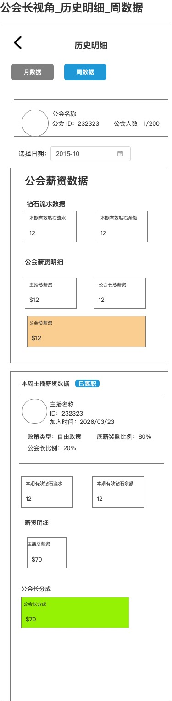

#### 页面结构调整

| 区域 | 1.3 规则 |
|---|---|
| 周期 Tab | 增加“月数据”“周数据”两个 Tab |
| 月数据 | 现有功能，无需调整 |
| 周数据 | 新增周历史数据看板 |
| 公会数据报表 | 字段结构同现有历史明细—公会薪资数据 |
| 主播数据报表 | 字段结构同现有历史明细—主播自由政策数据报表 |

#### 周历史数据范围

周历史需要展示：

- 当前政策为“自由政策（周结）”的主播薪资数据；
- 历史已结算的“自由政策（周结）”快照；
- 公会长本人为周结政策时，其作为主播的周结数据；
- 已离职且已经完成周结的主播数据。

#### 周历史字段与计算口径

周历史不重新执行工资计算，而是展示结算时已经冻结的计算输入、工资结果和余额结果。经公会 1.0、1.1、1.2 三份历史文档对照，1.1、1.2 未修改历史结算报表结构，因此其字段结构继承 1.0 的“历史明细—公会薪资数据”和“主播自由政策数据报表”。

**公会数据报表：**

| 字段 | 周历史取值规则 |
|---|---|
| 本期有效钻石流水 | 读取该自然周公会有效钻石流水快照；不得用当前实时流水替换 |
| 本期有效钻石余额 | 读取该自然周公会有效钻石余额快照；不得在历史页重新计算 |
| 主播总薪资 | 读取该周所有主播侧结算结果之和；其结算公式见 4.3.2 |
| 公会长总薪资 | 读取该周公会长管理收益快照，不包含本人主播工资 |
| 公会总薪资 | 读取同一快照中的 `主播总薪资 + 公会长管理周薪资` 结果，禁止跨快照拼接 |
| 公会薪资余额 | 读取该周 `公会总薪资` 的结算结果；金币/非金币余额池仍分别追溯 |

**主播数据报表：**

| 字段 | 周历史取值规则 |
|---|---|
| 主播名称 / 主播ID | 读取该周主播身份快照 |
| 加入时间 / 公会归属 | 读取该周成员关系快照；离职后不覆盖历史归属 |
| 政策类型 | 固定读取“自由政策（周结）”及其当期政策版本 |
| 本期有效钻石流水 | 读取该主播在该自然周、该公会归属下的 `D_flow` 快照 |
| 本期有效钻石余额 | 读取该主播在该自然周、该公会归属下的 `D_balance` 快照 |
| 主播总薪资 | 读取 `D_balance × 0.8 ÷ 130000 × 0.73` 的当期结算结果，包含金币/非金币工资拆分前的总额 |
| 主播薪资余额 | 读取该周工资结算结果；客户端历史卡片是否展示该字段见 P1-08 |
| 公会长分成 | 读取该主播 `D_flow × 0.8 ÷ 130000 × 0.27` 对应的公会长侧贡献结果 |
| 已离职 | 只表示当前或历史关系状态，不改变该周工资归属和金额 |

#### 历史读取规则

- 已结算周数据读取该自然周的结算快照，不重新执行 4.3 的公式。
- 主播后续离职、转会或政策变化，不改变已结算周历史。
- 已离职主播是否展示以该周是否存在已结算周结快照为准，不能只按当前成员关系过滤。
- 同一个周历史页面中的公会总账、主播明细、政策比例和余额结果必须来自同一快照版本。
- 后续提现、转账、冻结、失败回滚只追加资金流水或回滚记录，不改写原始周薪资、原始工资拆分和原始公会归属快照。

#### 原型问题

原型处于“周数据”视图，但日期仍显示月份格式 `2015-10`。该值不能作为周选择器方案；周数据必须使用自然周，具体客户端展示格式列入待确认。

---

### 5.5 月数据对照基线

#### 对应原型

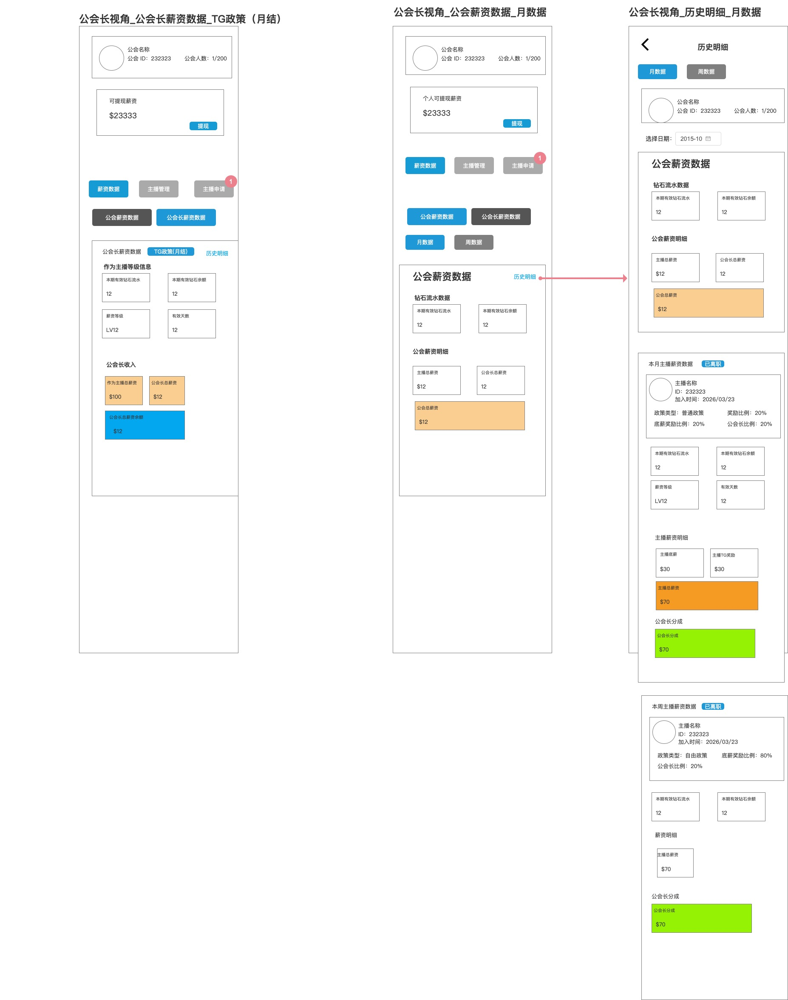

该图仅用于对照现有月数据页面。1.3 脑图明确月数据为现有功能、无需调整，因此：

- 不将图中的任何现有字段重新定义为 1.3 新增字段；
- 不改变月结政策的统计方式、计算方式和时间维度；
- 只在页面层增加月数据/周数据切换关系。

---

### 5.6 原型存在但未纳入正式需求的客户端页面

以下原型在 1.3 目录中真实存在，但脑图没有定义对应页面的新字段或新逻辑。为保证素材可追踪，保留图文对照；本节不是研发实现要求。

#### 主播自由政策页面

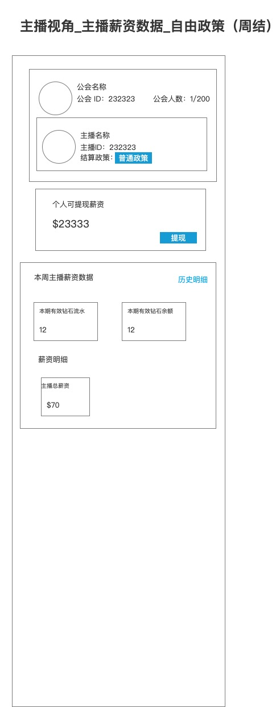

- 原型可见“本周主播薪资数据”等内容，但脑图没有定义主播本人薪资页改动。
- 图中政策标签显示“普通政策”，与文件名和周结场景冲突。
- 本次不据此新增主播薪资字段或修改逻辑。

#### 主播薪资页面

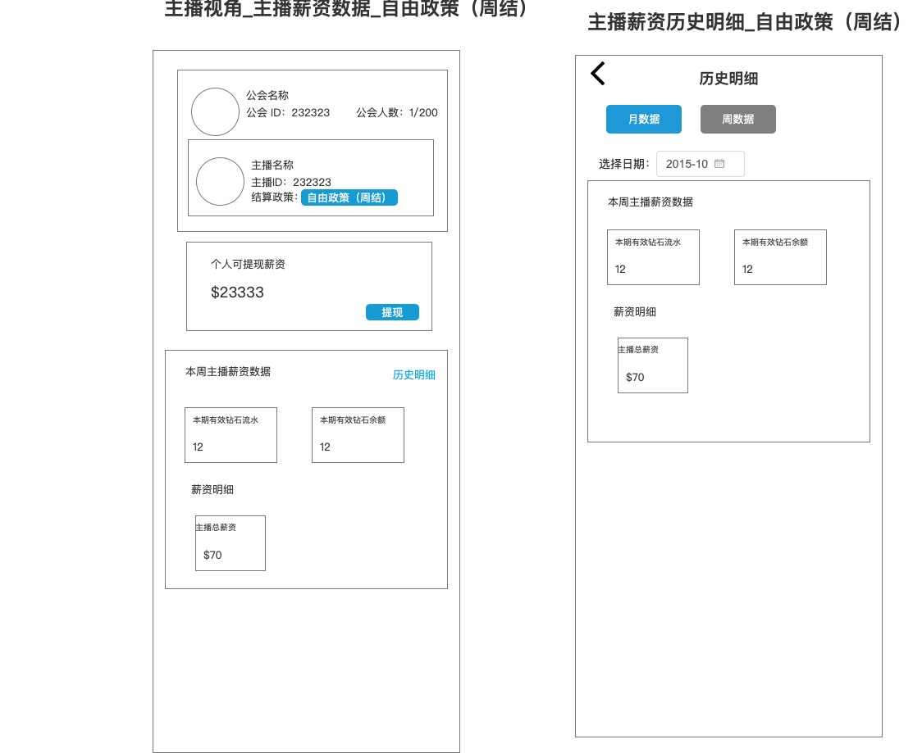

- 原型可见主播政策标签及月/周历史入口。
- 脑图未定义主播本人薪资页和主播历史页的 1.3 改动，本次不写成正式需求。
- 图中“月数据”选中但内容标题为“本周主播薪资数据”，状态矛盾，需产品确认是否补充正式范围。

#### 主播历史结算记录

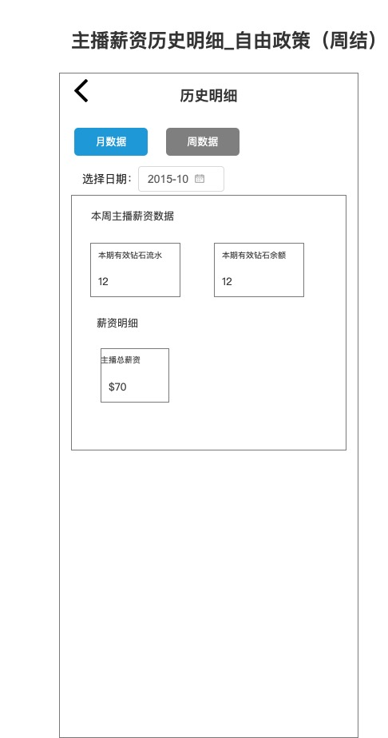

- 原型标题指向周结，但页面仍选中“月数据”并显示月份值。
- 脑图没有定义该页面的新规则，本次不据此新增周选择器、字段或跳转逻辑。

#### 公会长主播申请管理

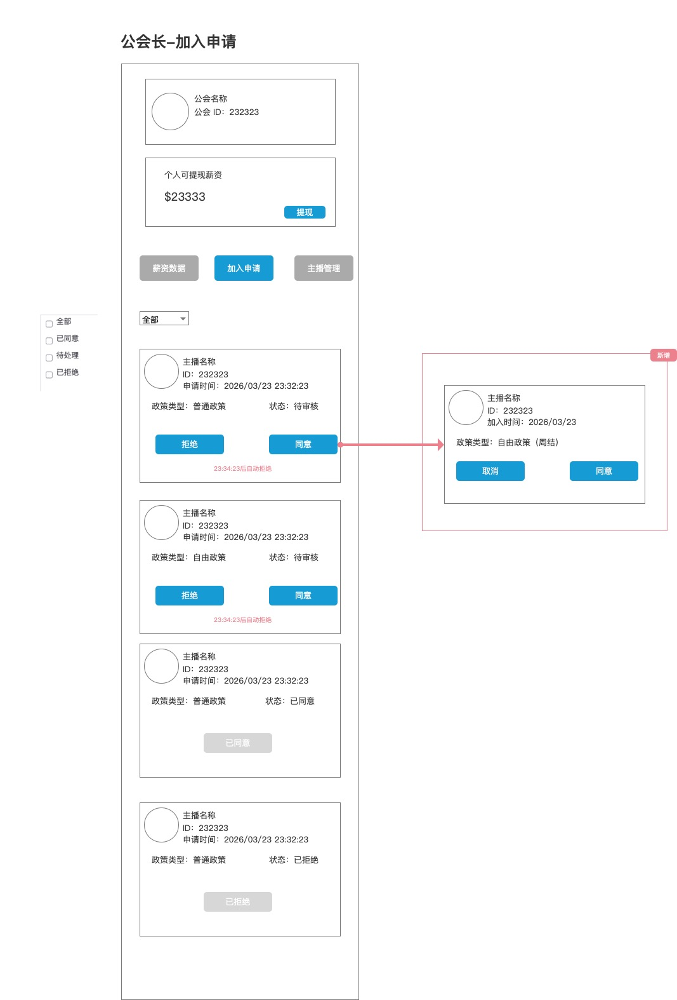

- 原型可见申请卡片展示“自由政策（周结）”。
- 脑图只定义主播加入公会时的政策选择，没有定义公会长审批页改动、自动拒绝或确认流程。
- 本次不把该页行为写成正式 1.3 需求。

#### 公会长主播管理

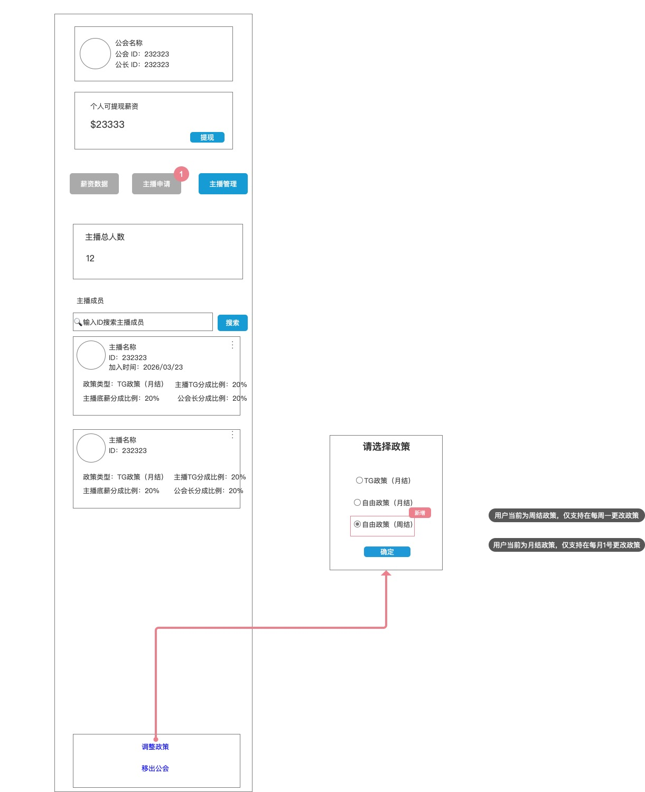

- 原型可见“调整政策”面板增加“周结政策”。
- 主播更改政策的开放日期、Toast及当天流水/余额转归按 3.5 执行；本次未据此增加公会长调整主播政策的权限、次数或页面入口。
- 本次不把该调整能力写成正式 1.3 需求。

---

## 六、后台增量需求

### 6.1 后台—主播列表

#### 对应原型

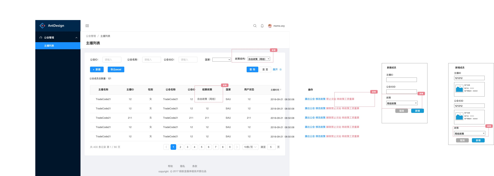

#### 1.3 改动

| 功能位置 | 改动内容 |
|---|---|
| 新增成员—政策 | 增加“自由政策（周结）” |
| 筛选—政策结构 | 增加“自由政策（周结）” |
| 列表—结算政策 | 支持显示“自由政策（周结）” |

#### 页面规则

- 新增成员时选择“自由政策（周结）”，保存后该主播的结算政策展示为同一完整名称。
- 政策筛选结果与列表“结算政策”展示使用同一政策枚举。
- 本次不根据原型补充国家筛选、禁止兑钻、踢出公会或修改政策规则。
- 原型中的“周结政策”简称统一按脑图正式名称“自由政策（周结）”处理。

---

### 6.2 后台—主播薪资

#### 对应原型

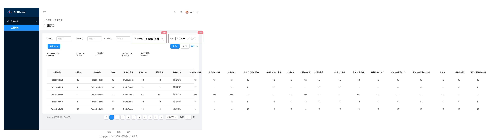

#### 筛选改动

| 筛选项 | 月结状态 | 周结状态 |
|---|---|---|
| 政策结构 | 支持同时选择“自由政策（月结）”“TG政策（月结）” | 选择“自由政策（周结）” |
| 日期 | 显示自然月选择器 | 显示自然周选择器 |
| 组合限制 | 两种月结政策可以同时选择 | 不支持与任一月结政策同时选择 |

#### 政策与日期联动

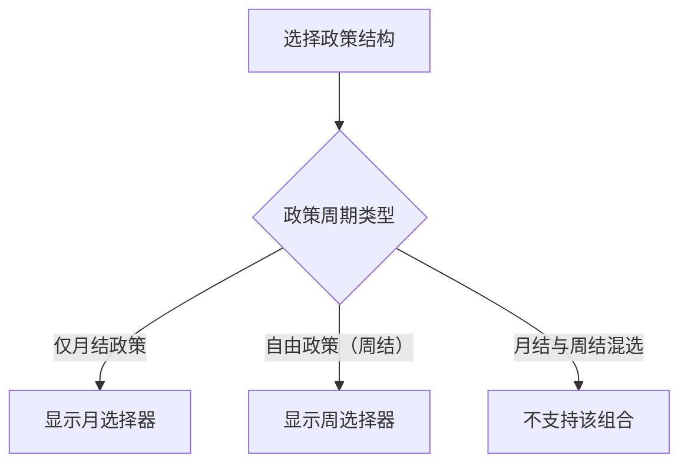
```mermaid
flowchart TD
    A[选择政策结构] --> B{政策周期类型}
    B -->|仅月结政策| C[显示月选择器]
    B -->|自由政策（周结）| D[显示周选择器]
    B -->|月结与周结混选| E[不支持该组合]
```

脑图没有定义“不支持组合”时的页面处理方式。禁用选项、自动清空已有选项或提交查询时提示均不得在本文擅自确定。

#### 汇总与列表数据

| 政策范围 | 统计方式 | 计算方式 | 时间维度 |
|---|---|---|---|
| TG政策（月结） | 沿用现有 | 沿用现有 | 自然月，不变 |
| 自由政策（月结） | 沿用现有 | 沿用现有 | 自然月，不变 |
| 自由政策（周结） | 按自然周、公会归属和周结政策快照统计 | 按 4.3 的自由政策周结公式及资金链处理 | 自然周 |

#### 周结主播薪资字段矩阵

| 字段 | 周结计算 / 取值规则 | 业务用途 |
|---|---|---|
| 结算政策 | 读取所选自然周的政策绑定快照，固定为“自由政策（周结）” | 区分月结与周结数据，历史不读当前政策 |
| 公会名称 / 公会ID / 公会长 | 读取该周公会归属快照 | 支持同周跨公会分单与追溯 |
| 起始钻石余额 | 读取自然周开始时的余额快照 | 用于解释余额变化，不直接替代 `D_balance` |
| 最终钻石余额 | 读取自然周结束或结算时的余额快照 | 结合起始余额、兑换钻石及调整项对账；不反向替代有效余额结算结果 |
| 兑换钻石 | 汇总该周已确认兑换/转出的钻石记录 | 解释钻石余额变化，不直接作为工资金额 |
| 本期有效钻石流水 | 读取该主播 `W + G` 范围内的 `D_flow` | 公会长侧工资基数及对账字段 |
| 本期有效钻石余额 | 读取该主播 `W + G` 范围内的 `D_balance` | 主播侧工资基数 |
| 主播总薪资 | `D_balance × 0.8 ÷ 130000 × 0.73` | 主播本周拆分前应发总工资 |
| 金币工资 | `主播总薪资 × 0.2` | 进入金币工资奖励余额；强制充值工资比例即金币工资比例 |
| 非金币工资 | `主播总薪资 × 0.8` | 进入工资型余额 |
| 主播薪资余额 | 结算汇总字段为 `主播总薪资`；底层余额池仍须拆分金币工资余额和非金币工资余额 | 结算结果与余额池对账 |
| 贡献公会长分成 | `D_flow × 0.8 ÷ 130000 × 0.27` | 归属该周、该公会的公会长管理收益 |
| 可提现余额 | 读取结算后允许进入对应提现出口的余额池结果；不得把金币工资直接算入现金可提现金额 | 提现资格与资产对账 |
| 通过主播转账金额 | 读取既有主播转入薪资记录，不作为本周工资公式输入 | 解释账户余额来源，避免与周薪重复累计 |

#### 后台计算顺序

1. 按自然周、主播、政策快照和公会归属筛选待结算数据。
2. 分别生成 `D_flow` 与 `D_balance`；两者用途不同，不能互换。
3. 计算主播总薪资和该主播贡献的公会长分成。
4. 对每个工资项分别按 20% 拆金币工资、80% 拆非金币工资。
5. 将金币工资与非金币工资分别写入对应余额池。
6. 生成主播周薪资记录、公会长贡献记录及同版本周结快照。
7. 汇总页、列表页、详情页和导出读取同一计算结果；已结算周不允许页面查询触发重算。

#### 政策更改当天的数据归属

政策更改成功后，当天更改前的流水和余额也按新政策参与薪资计算。查询、汇总、列表和导出按 3.5 读取转归后的数据，旧政策侧不重复保留同一笔统计结果；已结算历史与异常边界仍按 3.5 处理。本条只调整数据归属，不改变本页筛选方式。

#### 同周期多公会

- 用户在同一自然周加入多个公会时，需要形成多条属于不同公会的主播薪资数据。
- 后台主播薪资列表按公会分别展示这些记录，不能把不同公会的周薪合并为一条。
- 每条记录只归属该自然周内对应的公会薪资数据。
- 同一公会内多次加入形成不同归属时间段/快照的，保留独立结算记录；公会汇总时只累计一次，详见 8.3。

#### 导出

- 支持导出筛选后的“自由政策（周结）”数据。
- 导出数据范围与当前有效的周结政策筛选、自然周和其他已生效筛选条件一致。
- 导出字段结构沿用现有主播薪资导出，不根据原型表格列另行扩展。
- 导出文件名、同步/异步方式和历史范围未被脑图定义，本次不新增规则。

---

### 6.3 后台—公会薪资

#### 对应原型

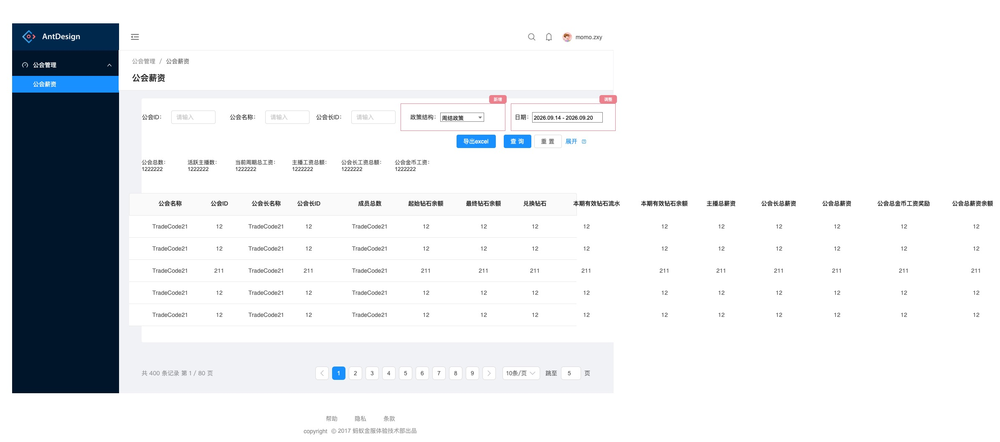

#### 筛选改动

本页原“政策类型”（旧文档称“政策结构”）筛选改为“结算周期”，枚举为“月结”“周结”，默认选择“月结”；本页不再按三种政策分别勾选。本次调整仅适用于后台—公会薪资，后台—主播薪资筛选规则不变。

| 筛选项 | 月结 | 周结 |
|---|---|---|
| 结算周期 | 默认选择月结 | 选择周结 |
| 选择日期 | 显示自然月选择器，查询所选自然月 | 显示自然周选择器，查询所选自然周 |
| 政策范围 | 同时查询自由政策（月结）与TG政策（月结） | 仅查询自由政策（周结），不混入两种月结政策 |

#### 汇总与列表数据

| 结算周期 | 政策范围 | 查询与计算口径 | 时间维度 |
|---|---|---|---|
| 月结 | 自由政策（月结）＋TG政策（月结） | 沿用现有查询逻辑，同时查询两种月结政策的公会薪资；计算规则不变 | 所选自然月 |
| 周结 | 仅自由政策（周结） | 按自然周、公会归属查询；先逐主播按 4.3 计算，再汇总公会总账 | 所选自然周 |

| 所选周期 | 数据读取规则 |
|---|---|
| 已结束周期 | 读取所选自然月或自然周的历史薪资数据；已结算数据读取对应历史快照，不按当前政策、成员关系或实时余额重算 |
| 当前周期 | 读取当前自然月或自然周的实时薪资数据，按上述结算周期对应的政策范围计算，不以历史快照替代实时数据 |

汇总、列表、详情和导出使用同一结算周期、日期、政策范围及数据读取口径。当前周期的实时薪资不等于已结算结果，查询本身不触发结算或余额池入账；已结束但结算未成功的数据沿用 4.5 的结算状态处理，不以实时结果冒充已结算历史。

#### 周结公会薪资字段矩阵

以下工资公式同时用于所选自然周的实时计算和历史结果解释。已结束周读取历史数据；当前周读取同口径实时计算结果。表中的结算快照、结算时余额及入账结果仅适用于已结算数据，不能在当前周查询时提前生成或入账。

| 字段 | 周结计算 / 取值规则 | 对账要求 |
|---|---|---|
| 公会总数 | 统计当前周结筛选结果中的公会记录数 | 同一公会同一自然周同一快照版本只计一次 |
| 活跃主播数 | 统计该周已进入有效结算范围的周结主播数 | 不得用当前成员数覆盖已结算周的成员范围 |
| 本期有效钻石流水 | `Σ 各主播 D_flow` | 必须等于该公会主播明细中有效流水之和 |
| 本期有效钻石余额 | `Σ 各主播 D_balance` | 必须等于该公会主播明细中有效余额之和 |
| 主播工资总额 / 主播总薪资 | `Σ（各主播 D_balance × 0.8 ÷ 130000 × 0.73）` | 必须先逐主播计算后汇总，不允许用公会总有效余额一次计算后替代分账 |
| 公会长工资总额 / 公会长总薪资 | `Σ（各主播 D_flow × 0.8 ÷ 130000 × 0.27）` | 只汇总公会长管理收益，不包含本人主播工资 |
| 当前周期总工资 / 公会总薪资 | `主播工资总额 + 公会长管理工资总额` | 两部分必须来自同一自然周、同一公会；历史数据使用同一快照版本，当前周使用同口径实时结果，不跨两类结果拼接 |
| 公会总金币工资 / 公会金币工资 | `Σ 各工资项金币工资` | 由逐工资项拆分结果汇总，不允许在公会总薪资上一次性倒拆 |
| 公会总非金币工资 | `Σ 各工资项非金币工资` | 用于工资型余额入账 |
| 公会总薪资余额 / 公会总余额 | `公会总薪资` 的结算汇总结果 | 底层仍应满足：金币工资余额 + 非金币工资余额；不能直接等同现金可提现余额 |
| 起始钻石余额 | 汇总/读取自然周开始时的公会维度余额快照 | 只用于余额变动对账，不直接参与工资公式 |
| 最终钻石余额 | 汇总/读取自然周结算时的公会维度余额快照 | 与起始余额、兑换钻石及调整结果共同解释余额变化 |
| 兑换钻石 / 公会总兑换钻 | `Σ 该周已确认兑换钻石记录` | 不直接等同有效钻石余额或工资金额 |
| 结算快照版本 | 已结算周读取对应结果版本；当前周实时数据不作为已结算快照 | 历史汇总、列表、详情和导出禁止跨版本拼接，实时查询保持同一周期和政策范围 |

#### 公会总账与分账校验

- 公会汇总必须由主播级周结记录与公会长侧贡献记录向上汇总，不能只有一个无法下钻的总结果。
- `公会总薪资 = 主播工资总额 + 公会长管理工资总额`。
- `公会总金币工资 = Σ 主播侧金币工资 + Σ 公会长侧金币工资`。
- `公会总非金币工资 = Σ 主播侧非金币工资 + Σ 公会长侧非金币工资`。
- 同一笔主播工资和同一笔公会长贡献在一个公会周总账中只能累计一次。

#### 政策更改当天的数据归属

政策更改成功后，当天更改前的流水和余额也按新政策参与薪资计算。查询、汇总、列表和导出按 3.5 读取转归后的数据，旧政策侧不重复保留同一笔统计结果；已结算历史与异常边界仍按 3.5 处理。本条只调整数据归属，不改变本页筛选方式。

#### 同周期多公会

- 同一用户在同一自然周加入多个公会时，相关薪资按不同公会分别形成数据。
- 公会薪资汇总和列表必须按公会归属统计，不得把用户在不同公会的记录合并到错误公会。
- 已结算周数据读取对应公会和自然周的快照。

#### 导出

- 结算周期为月结时，沿用现有导出，范围包含所选自然月的自由政策（月结）和TG政策（月结）公会薪资数据。
- 结算周期为周结时，仅导出所选自然周的自由政策（周结）公会薪资数据；自然周口径使用 UTC+3。
- 导出与页面查询采用相同的结算周期、日期和政策范围：已结束周期读取历史薪资，当前周期读取实时薪资；已结算历史按对应归属快照读取。
- 导出字段结构沿用现有公会薪资导出，不从原型表格列推导新增字段。

---

## 七、金币工资与提现增量需求

### 7.1 主播/公会长—金币工资说明与全部提现

#### 对应原型

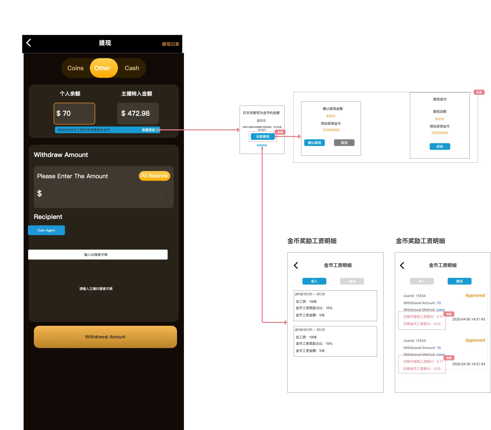

#### 页面改动

在金币工资说明区域新增“全部提现”按钮。

| 页面元素 | 1.3 规则 |
|---|---|
| 全部提现 | 新增；以确认提现弹窗打开时的全部可用金币工资金额作为本次申请金额 |
| 确认提现金额弹窗 | 点击“全部提现”后显示 |
| 提现金额 | 显示并锁定确认提现弹窗打开时的全部可用金币工资金额 |
| 预估获得金币 | 根据金币工资美元金额和 `1 USD = 5000 金币` 自动换算 |
| 确认提现 | 按弹窗锁定金额校验可用余额、冻结并生成申请；审核通过后扣减及发放金币，不在点击时直接完成发放 |

#### 计算公式

- 预估获得金币 = 确认提现弹窗打开时锁定的金币工资金额（USD）× 5000。
- 金币工资专属提现比例：`1 USD = 5000 金币`。

#### 金额锁定、审核与失败处理

沿用 1.0 的 5.5、6.7 提现金币，以及 9.7 后台提现审核、9.8 提现记录；1.1、1.2 未修改该链路。本次专属入口只处理金币工资余额。

| 场景 | 处理规则 |
|---|---|
| 打开确认提现弹窗 | 读取当时全部可用金币工资，锁定申请美元金额与对应预估金币；打开弹窗本身不冻结、不扣减 |
| 弹窗打开后余额增加 | 本次仍使用弹窗打开时金额，新增余额不自动追加到本次申请 |
| 点击确认提现 | 重新校验金币工资可用余额能否覆盖已锁定金额；校验通过后仅冻结锁定金额，生成 Waiting 申请并记录余额池及冻结结果 |
| 当前余额不足 | 不得按旧弹窗金额超额扣减，也不得自动改成较小金额提交；不生成有效申请，沿用历史余额不足提示；不新增自动刷新或自动改额提交规则 |
| 取消 | 关闭弹窗，不生成申请、不冻结、不扣减 |
| 审核通过 | 校验冻结结果，进入审核通过待发放，正式扣减锁定金额并按 1 USD = 5000 金币发放 |
| 审核拒绝 | 记录拒绝原因，释放本申请冻结金额回原金币工资余额池 |
| 发放失败 | 进入失败回滚链路，按原申请恢复冻结或已扣减结果；保留失败及回滚状态，不将失败直接写为成功或改回 Waiting |
| 重复处理 | 同一申请只允许一次有效审核、扣减和发放；重试关联原申请状态和结果，不重复冻结或发放 |
| 记录追溯 | 保留弹窗锁定金额、预估金币、申请金额、来源余额池、冻结、审核、发放及回滚结果；客户端明细与全局记录展示位置仍见 P1-04 |

#### 两个“全部”入口的边界

- 本次新增的“全部提现”只处理金币工资。
- 原普通提现表单中的 `All Balance` 属于现有功能，不因本次新增按钮而改变含义。
- 两个入口不能共用同一个可提现基数或换算比例。

#### 原型冲突

原型示例为 `$1212 → 12120000 金币`，该数值不符合脑图的 `1 USD = 5000 金币`。正式需求只采用脑图比例，原型示例不得作为计算依据。

原型中的“提现成功”弹窗未被脑图定义，本次不写成正式页面流程。

---

### 7.2 金币工资明细

#### 对应原型

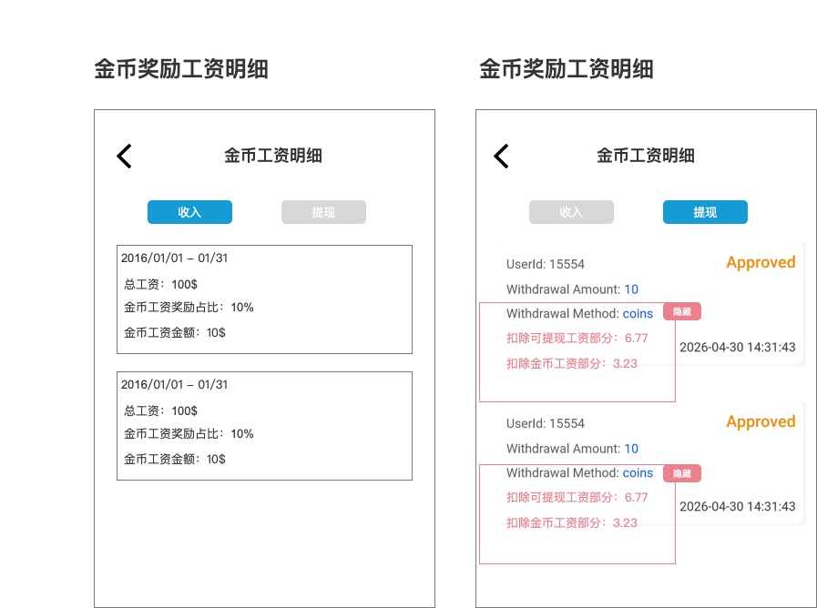

#### 1.3 字段调整

在金币工资明细中隐藏：

- 扣除可提现工资部分；
- 扣除金币工资部分。

#### 边界

- 只隐藏脑图明确点名的两个字段。
- `UserId`、状态、提现金额、提现方式和时间等原型可见字段不属于 1.3 新增定义，继续按现有版本处理。
- 原型收入记录中的总工资、金币工资奖励占比和金币工资金额未被脑图定义，本次不建立新统计规则。

---

### 7.3 普通工资提现为金币

#### 新增回充工资金额提示

本提示为用户针对更新原型明确补充的需求；对应原型见 7.1，不因脑图尚未补写而排除本次明确新增内容。

| 页面元素 | 展示与交互规则 |
|---|---|
| 展示位置 | 主播/公会长提现金币页的余额区域下方、提现金额输入区域上方；更新原型展示公会长视角 |
| 提示文案 | `有${金额}为回充工资仅支持提现为金币`；原型中的 `$30` 为示例金额，不固定为 30 |
| 金额口径 | 展示当前用户的金币工资余额，单位为 USD；与“查看原因”打开的金币工资说明弹窗使用同一金额口径，不展示换算后的金币数量，也不将主播转入金额当作金币工资 |
| 查看原因 | 点击进入 7.1 的金币工资说明弹窗，展示仅支持提现为金币的金额及说明；可继续使用“全部提现”入口 |
| 入口边界 | 提示条不改变普通提现表单的可提现基数；其中提示的金币工资仍走专属“全部提现”入口，不能混入普通工资提现金额 |

金币工资余额为 0 时提示条是否隐藏，以及金额刷新时机，当前材料未明确，见 P1-09；不据此扩展 Cash、Other 标签页的新增展示规则。

#### 1.3 逻辑调整

| 规则项 | 1.3 规则 |
|---|---|
| 实际可提现金币金额 | 总可提现金额 - 金币工资=非金币工资 |
| 提现金额校验 | 提现金额 > 0，且 ≤ 总可提现金额 - 金币工资；同时沿用所选余额池的可用余额校验 |
| 可处理工资范围 | 仅支持非金币工资通过普通提现金币入口提现 |
| 非金币工资提现金币比例 | `1 USD = 105000 金币` |

“总可提现金额”和“可提现金额”为同一口径，统一称“总可提现金额”，在上述公式中包含金币工资；仅扣除一次金币工资得到普通工资可提现基数。该公式不改变原有余额池选择边界，不得把个人余额与主播转入金额跨池拼接扣减。

#### 比例隔离

| 工资类型 | 提现入口 | 换算比例 |
|---|---|---:|
| 金币工资 | 金币工资说明区域的“全部提现” | 1 USD = 5000 金币 |
| 非金币工资 | 现有普通提现金币入口 | 1 USD = 105000 金币 |

- 同一笔工资只能按其工资类型命中对应比例。
- 普通提现金币入口的可提现基数必须排除金币工资。
- 金币工资不能通过普通提现金币入口按 `1 USD = 105000 金币` 换算。
- 非金币工资不能通过金币工资“全部提现”入口按 `1 USD = 5000 金币` 换算。

### 7.4 提现处理主链

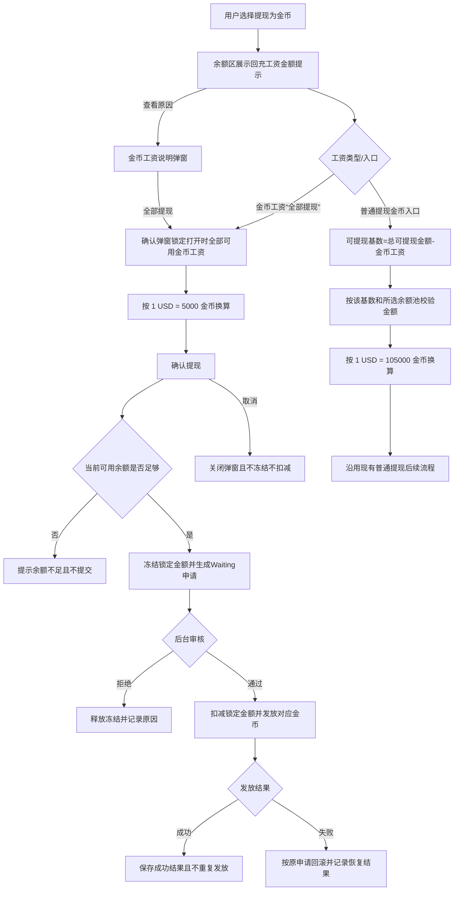
```mermaid
flowchart TD
    A[用户选择提现为金币] --> A1[余额区展示回充工资金额提示]
    A1 --> B{工资类型/入口}
    A1 -->|查看原因| A2[金币工资说明弹窗]
    A2 -->|全部提现| C
    B -->|金币工资“全部提现”| C[确认弹窗锁定打开时全部可用金币工资]
    C --> D[按 1 USD = 5000 金币换算]
    D --> E[确认提现]
    E --> F{当前可用余额是否足够}
    F -->|否| F1[提示余额不足且不提交]
    F -->|是| F2[冻结锁定金额并生成Waiting申请]
    F2 --> F3{后台审核}
    F3 -->|拒绝| F4[释放冻结并记录原因]
    F3 -->|通过| F5[扣减锁定金额并发放对应金币]
    F5 --> F6{发放结果}
    F6 -->|成功| F7[保存成功结果且不重复发放]
    F6 -->|失败| F8[按原申请回滚并记录恢复结果]
    E -->|取消| F9[关闭弹窗且不冻结不扣减]
    B -->|普通提现金币入口| G[可提现基数=总可提现金额-金币工资]
    G --> H[按该基数和所选余额池校验金额]
    H --> I[按 1 USD = 105000 金币换算]
    I --> J[沿用现有普通提现后续流程]
```

### 7.5 提现记录原型对照

#### 对应原型

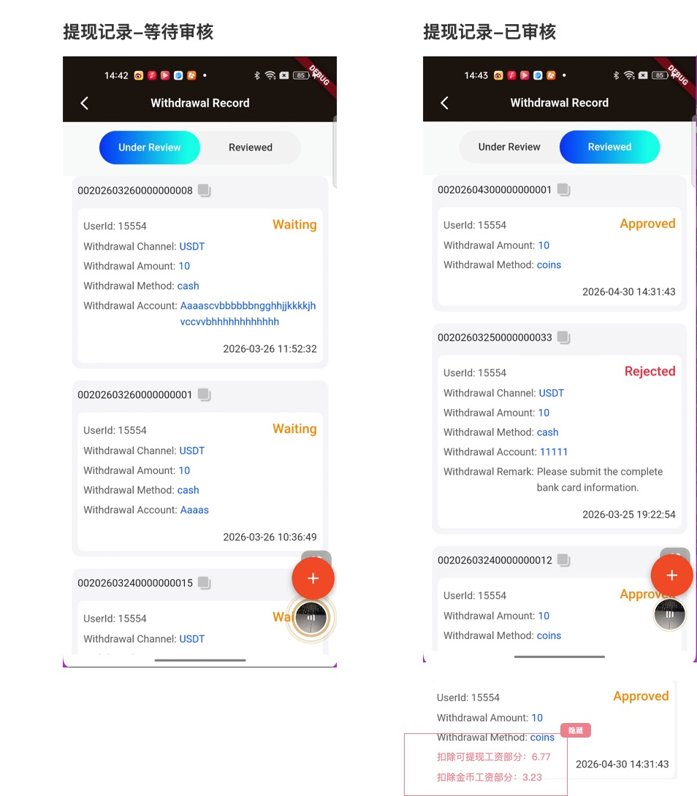

脑图只点名提现记录中的“扣除可提现工资部分、扣除金币工资部分”字段，但没有写明隐藏、删除或保留动作；与“金币工资明细—隐藏”节点不同。

因此：

- 本次不将提现记录中的两个字段直接写成隐藏要求；
- 该处理动作列入待确认；
- 提现记录的其他字段、状态和复制操作不属于 1.3 新增需求。

---

## 八、快照、历史和跨公会归属

### 8.1 周结快照

周结完成后，沿用现有自由政策快照原则，并增加自然周维度。周结快照是客户端历史、后台查询、导出和争议对账的共同事实源；它不是一张只存最终金额的结果表，而是要能解释“哪一周、哪个公会、哪套政策、哪些输入、如何拆分、扣了什么、进了哪个余额池”。

| 快照组 | 至少保留的业务事实 | 用途 |
|---|---|---|
| 周期快照 | 自然周标识、周开始/结束、结算触发时点、业务时区 | 防止前后台错周；固定记录 UTC+3 及左闭右开的周区间 |
| 政策快照 | “自由政策（周结）”、政策版本、分成比、钻石换算美元比例、主播分成比例、公会长分成比例、金币工资拆分比例 0.2 | 历史不得读取当前政策重算 |
| 政策更改归属 | 更改前后政策、操作人、操作对象、操作时间、归属日期、对应月/周周期及当天流水和余额转归结果 | 更改当天的更改前数据也按新政策计算；与原归属核对，防止月结、周结重复统计 |
| 关系快照 | 主播、公会、公会长、身份、加入/离开关系及该周归属 | 支持离职历史和同周跨公会分单 |
| 钻石输入快照 | 起始钻石余额、最终钻石余额、兑换钻石、本期有效钻石流水、本期有效钻石余额、无效/冻结调整结果 | 解释工资基数与余额变化 |
| 主播工资快照 | 单个主播总薪资、金币工资、非金币工资、非金币余额 | 支持主播账与余额池对账 |
| 公会长工资快照 | 每个主播贡献的公会长分成、公会长本人主播工资项、公会长管理工资、金币/非金币拆分 | 管理工资不含本人主播工资；本人主播工资仅计入主播总薪资，避免双身份重复累计 |
| 公会汇总快照 | 主播工资总额、公会长管理工资总额、公会总薪资、公会总金币工资、公会总非金币工资、公会薪资余额 | 支持公会总账与成员分账勾稽 |
| 余额池结果 | 主播/公会长个人薪资余额、金币工资奖励余额、主播转入薪资余额的本次入账或承接关系 | 保证提现资产范围可追溯 |
| 处理状态 | 结算状态、快照版本及既有重试/补偿所需的业务标识 | 防止重复结算、重复入账 |

上述内容用于既有资金链和历史追溯，不代表全部需要显示在客户端页面。客户端只展示脑图明确继承的现有报表字段；后台和导出按现有字段范围承接，快照内部的计算中间结果不能因为页面未展示就丢失。

### 8.2 当前数据与历史数据

| 场景 | 数据来源 |
|---|---|
| 公会薪资—当前周数据 | 读取归属于自由政策（周结）的主播及公会长本人周数据；政策更改当天按 3.5 纳入或移出对应当天流水和余额，不在月结、周结重复统计 |
| 公会薪资—历史周数据 | 对应自然周已结算快照 |
| 已离职主播历史 | 只要存在该周已结算周结快照，继续展示 |
| 后台已结算周查询 | 对应自然周、政策和公会的结算记录/快照 |
| 周结导出 | 与当前周查询条件和结果范围一致 |

### 8.3 同周期加入多个公会

脑图明确要求用户同周期加入多个公会时，在不同公会形成多条薪资数据。

| 业务场景 | 处理规则 |
|---|---|
| 用户同一自然周只在一个公会 | 形成该公会对应的周薪资数据 |
| 用户同一自然周加入多个公会 | 按不同公会形成多条薪资数据 |
| 后台主播薪资 | 分别展示不同公会下的数据 |
| 后台公会薪资 | 各公会仅统计归属于本公会的数据 |
| 已结算历史 | 按对应自然周和公会快照读取，不按当前公会关系合并 |

沿用 1.0 的 3.6 入会与离会、6.11 主播移除、9.4 主播薪资规则；1.1、1.2 未修改该结算归属链：

1. 同一时刻只允许一个有效公会归属。原公会关系未结束时，不得直接加入新公会。
2. 按“主播 + 自然周 + 公会ID + 归属时间段/归属快照”形成独立结算记录；同周重新加入同一公会也保留各段记录，不以主播和周、公会ID合并去重。
3. 离会/移除前先结算原公会归属期间的有效流水、有效余额和工资；结算成功、生成快照及余额池结果后清空已结算钻石余额，再解除原关系。未完成结算不得直接切断归属。
4. 新公会仅承接新归属期间产生的数据，不接管原公会工资和余额；离会后、加入新公会前的数据不得因后来入会倒挂给新公会。
5. 已结算原公会记录保留在该自然周历史中。周一结算仅处理尚未结算部分，不再次结算或入账已完成的离会记录。
6. 公会周报按各自归属时间段汇总，后台明细及导出保留归属快照；客户端同周历史与后台总额应能对应。结算后的个人余额仍归用户本人。

### 8.4 离职历史

- 已离职且已经完成周结的主播必须显示在周历史中。
- 展示依据是已结算周结快照，不是当前成员列表。
- 1.3 未重新定义主动离会、公会移除或离会强制结算流程；相关处理继续沿用现有版本。
- 未完成周结时离会，按 8.3 先结算原公会归属期间的数据，保存为对应自然周下的离会结算记录；周一不重复入账。

---

## 九、原型一致性与修正清单

### 9.1 原型命名冲突

| 原型位置 | 原型现状 | 正式口径 |
|---|---|---|
| 主播自由政策页 | 显示“普通政策” | 不能作为周结政策展示依据 |
| 公会长周结页 | 分别出现“周结”“自由政策”“自由政策（周结）” | 统一为“自由政策（周结）” |
| 公会长主播管理 | 出现“周结政策” | 脑图正式名称为“自由政策（周结）” |
| 后台新增成员/公会薪资 | 出现“周结政策” | 脑图正式名称为“自由政策（周结）” |

### 9.2 周数据日期冲突

| 原型 | 当前显示 | 正式规则 |
|---|---|---|
| 公会长历史周数据 | `2015-10` | 应承载自然周，具体展示格式待确认 |
| 主播历史原型 | 月数据选中且显示 `2015-10`，但内容标题为本周数据 | 未纳入正式范围，需产品确认是否补图/补脑图 |
| 后台主播薪资 | `2026.09.14 - 2026.09.20` | 可作为自然周日期区间布局参考 |
| 后台公会薪资 | `2026.09.14 - 2026.09.20` | 可作为自然周日期区间布局参考 |

### 9.3 金币换算示例冲突

| 原型示例 | 原型隐含比例 | 脑图正式比例 | 处理 |
|---|---:|---:|---|
| `$1212 → 12120000 金币` | 1 USD = 10000 金币 | 金币工资为 1 USD = 5000 金币 | 原型示例必须修正；PRD不得采用原示例 |

### 9.4 原型覆盖但脑图未定义的内容

| 原型模块 | 原型可见内容 | 本文处理 |
|---|---|---|
| 主播薪资/历史 | 周数据标题、月/周 Tab、日期控件、薪资字段 | 不纳入正式需求 |
| 公会长主播申请 | 周结政策展示、审核按钮、自动拒绝 | 不纳入正式需求 |
| 公会长主播管理 | 调整政策加入周结项 | 不纳入正式需求 |
| 提现成功弹窗 | 金额、预计金币、好的 | 不纳入正式需求 |
| 金币工资收入记录 | 总工资、奖励占比、金币工资金额 | 不建立新字段/公式 |
| 提现记录 | 完整字段、状态和复制入口 | 除待确认字段外均沿用旧版 |

---

## 十、人工确认落实与剩余问题

### 10.1 P0—阻塞结算与资金实现

人工确认原文保留如下；已确认内容已同步至对应功能章节，不再作为未决问题。P0-04 的旧人工确认已被最新规则替代：当前周结仅每周一可改，当前月结仅每月1号可改，更改当天的更改前流水和余额也归新政策；仅剩日期时区及当天已结算数据冲突待确认。

| 编号 | 事项 | 人工确认（原文） | 落实状态 | 正文规则 / 剩余边界 | 关联章节 |
|---|---|---|---|---|---|
| P0-01 | 自然周时区与区间 | UTC+3 | 已落实 | UTC+3；周一 00:00（含）至下周一 00:00（不含），同步统计、查询、导出和快照 | 2.3、3.4、4.3、8.1 |
| P0-02 | 金币工资拆分比例 | 强制充值工资比例0.2就是金币工资 | 已落实 | R_coin = 0.2，逐工资项拆分 20% 金币工资、80% 非金币工资；总工资分成比 0.8 不变 | 4.2～4.5、6.2、8.1 |
| P0-03 | 跨公会及重复入会归属 | 参考历史文档的逻辑补充 | 已落实 | 沿用历史：按归属时间段/快照分单，离会先结算后解除关系；周一不重复入账已结算记录 | 4.3、6.2～6.3、8.3～8.4 |
| P0-04 | 政策切换日期与当天数据归属 | 现在只有每个月1号才能切换政策 | 旧确认已替代；最新规则已落实，仍有剩余边界 | 最新确认：当前周结仅每周一、当前月结仅每月1号可改；两类限制Toast及当天更改前流水和余额计入新政策已落实。剩余待确认：日期判断时区；当天已结算数据如何兼容新归属与历史不重算 | 3.5、4.3、6.2～6.3、8.1～8.2 |
| P0-05 | 金币工资提现审核与回滚 | 参考历史文档的逻辑补充 | 已落实 | 沿用历史提交冻结、审核扣减发放、拒绝释放及失败回滚；专属入口仅处理金币工资 | 7.1、7.4 |
| P0-06 | 全部提现金额取值时点 | 以弹窗时的金额为准 | 已落实 | 确认提现弹窗打开时锁定金额；提交校验当前可用余额，不把后续新增工资自动追加到本次 | 7.1、7.4 |
| P0-07 | 普通工资可提现金额命名 | 同一口径 | 已落实 | 两名称统一为总可提现金额；按脑图公式仅扣除一次金币工资，保留所选余额池限制 | 7.3 |
| P0-08 | 公会长总薪资构成 | 不包含本人主播薪资 | 已落实 | 仅含管理收益，不含本人主播薪资；本人主播薪资计入主播总薪资一次 | 4.3、5.3～5.4、6.3、8.1 |

### 10.2 P1—影响前后台一致性和对账

| 编号 | 待确认项 | 当前材料状态 | 影响 |
|---|---|---|---|
| P1-01 | 月结与周结混选时的页面处理 | 只定义“不支持同时选择” | 前端交互和查询校验存在多种实现 |
| P1-02 | 周选择器的展示格式、默认周和可选范围 | 后台原型有日期区间；客户端周历史仍为月份格式 | 客户端、后台周查询体验不一致 |
| P1-03 | 提现记录中的两个扣减字段是否隐藏 | 原型标注隐藏；脑图只点名字段，没有动作 | 金币工资明细与全局提现记录展示不一致 |
| P1-04 | 金币工资全部提现写入金币工资明细、提现记录还是两处 | 脑图未定义记录落点 | 客服和财务无法确认唯一流水来源 |
| P1-05 | 美元金额精度和换算金币取整规则 | 两套比例均未定义精度和取整 | 页面预估、实际发放和账务可能出现差异 |
| P1-07 | 客户端“周数据”默认展示当前进行中的实时数据，还是最近一个已结算自然周 | 只定义政策范围和历史快照，未定义当前页所处结算状态 | 页面金额、历史入口和用户认知可能错位 |
| P1-08 | 自由政策（周结）的客户端主播历史卡片是否展示“主播薪资余额” | 历史字段及裁剪说明需与当前展示范围核对；1.3 脑图只定义沿用现有报表结构 | 余额计算结果保留，客户端字段展示范围待确认 |
| P1-09 | 回充工资金额为 0 时提示条是否隐藏，以及提示金额刷新时机 | 更新原型和用户确认明确新增提示，但未定义零余额和刷新行为 | 影响提示展示与余额变化后的页面一致性 |

### 10.3 P2—原型和文案

| 编号 | 待确认项 | 当前材料状态 | 影响 |
|---|---|---|---|
| P2-01 | 主播本人薪资页/历史页是否属于 1.3 正式范围 | 有原型、脑图无节点 | 不能仅凭原型安排开发 |
| P2-02 | 公会长申请管理和主播管理是否接入完整周结名称 | 有原型、脑图未定义页面改动 | 页面可能继续显示简称 |
| P2-03 | 金币工资说明中的“政策额外奖励金额”是否统一改为“金币工资” | 原型与脑图名词不同 | 用户与客服可能理解为两个资产 |
| P2-04 | 原型中的提现成功弹窗是否纳入 1.3 | 有原型、脑图未定义 | 设计稿与研发范围不一致 |

---

## 十一、源材料覆盖与原型映射

### 11.1 脑图一级范围覆盖

| 脑图一级节点 | PRD章节 | 覆盖状态 |
|---|---|---|
| 加入公会 | 5.1 | 已覆盖 |
| 公会长视角—薪资页面 | 5.2～5.5 | 已覆盖 |
| 新增政策—自由政策（周结） | 三、四 | 已覆盖 |
| 后台—主播列表 | 6.1 | 已覆盖 |
| 后台—主播薪资 | 6.2 | 已覆盖 |
| 后台—公会薪资 | 6.3 | 已覆盖 |
| 提现—金币工资说明 | 7.1 | 已覆盖 |
| 提现—金币工资明细 | 7.2 | 已覆盖 |
| 提现—提现金币 | 7.3～7.4 | 已覆盖 |
| 提现记录字段 | 7.5、10.2 | 已按“动作未定义”列待确认 |

### 11.2 原型文件映射

| 序号 | 原型文件 | 对应章节 | 处理方式 |
|---:|---|---|---|
| 1 | 主播视角_加入公会.jpg | 5.1 | 正式需求证据 |
| 2 | 主播视角-自由政策.jpg | 5.6 | 脑图未定义，不纳入正式需求 |
| 3 | 主播视角-薪资页面.jpg | 5.6 | 脑图未定义，不纳入正式需求 |
| 4 | 主播视角-历史结算记录_自由政策.jpg | 5.6 | 脑图未定义，不纳入正式需求 |
| 5 | 公会长视角-薪资页面（周数据）.jpg | 5.2 | 正式需求组合参考 |
| 6 | 公会长视角-薪资页面（月数据）.jpg | 5.5 | 月数据对照基线 |
| 7 | 公会长视角-公会薪资数据_周数据.jpg | 5.3 | 正式需求证据 |
| 8 | 公会长视角-公会长薪资数据_周数据.jpg | 5.2 | 正式需求证据 |
| 9 | 公会长视角-历史结算记录_周数据.jpg | 5.4 | 正式需求证据 |
| 10 | 公会长视角-主播申请管理.jpg | 5.6 | 脑图未定义，不纳入正式需求 |
| 11 | 公会长视角-主播管理.jpg | 5.6 | 脑图未定义，不纳入正式需求 |
| 12 | 后台-主播列表.jpg | 6.1 | 正式需求证据 |
| 13 | 后台-主播薪资.jpg | 6.2 | 正式需求证据 |
| 14 | 后台-公会薪资.jpg | 6.3 | 正式需求证据 |
| 15 | 主播_公会长-金币工资奖励说明.jpg | 7.1、7.3 | 金币工资说明、全部提现及用户确认新增的回充工资金额提示；示例值冲突已隔离 |
| 16 | 金币奖励工资明细.jpg | 7.2 | 正式需求证据 |
| 17 | 提现记录.jpg | 7.5 | 脑图未定义处理动作，列待确认 |

---

## 十二、与旧版本共存原则

1. 1.3 是相对用户前面提供的公会 1.0、1.1、1.2 三份历史文档形成的增量文档，三份历史文档均属于本次需求的继承依据。
2. 三份历史文档按“1.0 完整基线 → 1.1 增量 → 1.2 增量”对照；1.1、1.2 明确未调整的薪资、结算、提现和资产链路，继续落回 1.0 的完整规则读取。
3. 1.1 已定义的管理员角色和权限边界继续沿用；1.3 未调整管理员权限。
4. 1.2 中未形成明确增量且与 1.1 冲突的管理员权限内容，不作为 1.3 扩权依据。
5. 两种月结政策的计算、统计、结算和历史规则保持不变。
6. 周结政策只在脑图明确位置接入客户端、后台和提现链路。
7. 周结结果继续使用现有工资拆分、余额池、提现、失败处理和历史快照机制；本文明确变更的提现比例及入口规则除外。
8. 原型有而脑图没有定义的字段和逻辑，不因本次文档引用图片而自动进入研发范围。
